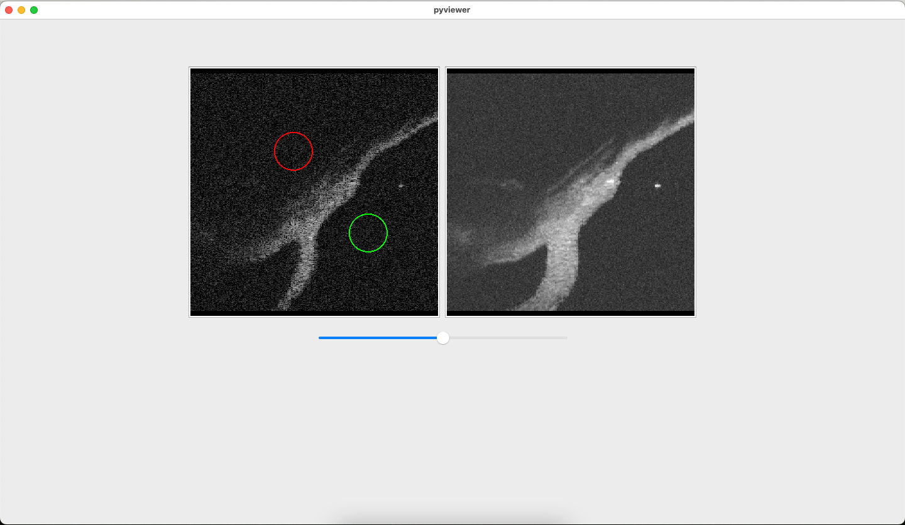

# OCT Image Viewer

**For scientific analysis of 512×512×512 uint8 .dat volumes from an OCT scanner**



## Quick Start
1. Download `oct_viewer.exe` from [latest release](https://github.com/asgilliard/oct_viewer/releases/latest)
2. Run and open your .dat file
3. Use slider to navigate slices

## For Developers

A simple viewer for `.dat` images from an OCT scanner, built with Python and PySide6.

### Requirements

- Python 3.10+  
- NumPy
- [PySide6](https://pypi.org/project/PySide6/)
- [uv](https://docs.astral.sh/uv/) - python package manager (optional)


### Setup and use

1. Sync dependencies using uv:

```bash
uv sync
```

or by creating .venv and using pip:

```bash
python -m venv .venv

# Linux or macOS
source .venv/bin/activate
# Windows
.venv\Scripts\activate 

pip install -r requirements.txt
```

2. Run:

```bash
uv run main.py

# Or using python:
python main.py
```

3. Use:

Use menu bar to open .dat file.

### .dat generation

You can generate an example .dat file using built-in generator:

```
uv run generator.py
```

Now open images/generated.dat

### Building design_ui.py

```
uv run pyside6-uic ui/design.ui -o design_ui.py
```

### Notes
- Make sure .dat files are 512×512×512 and uint8.
- The viewer uses QGraphicsView for scalable display.
